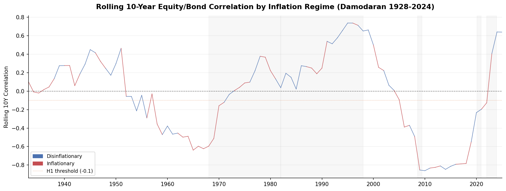
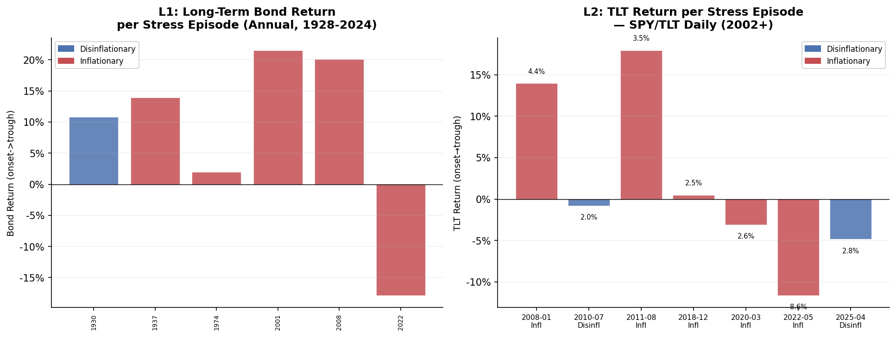
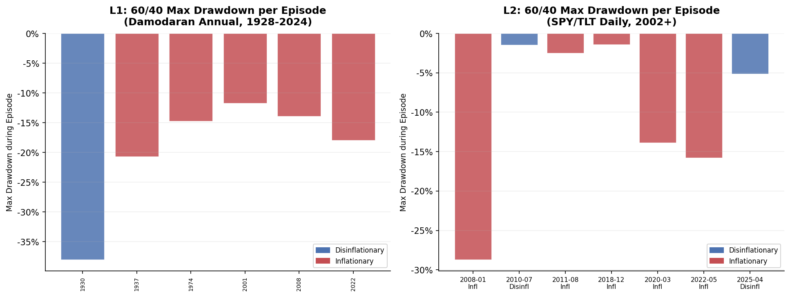
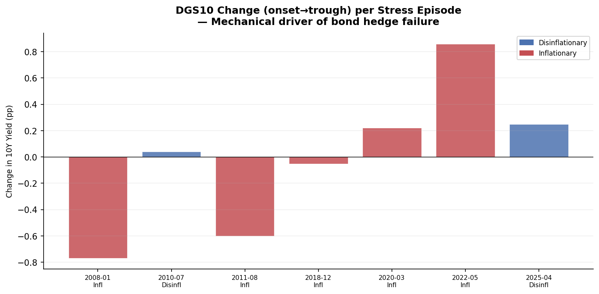

# UC2 — Bonds Are Safe Haven Only in Disinflationary Regimes
### The bond/equity negative correlation is regime-dependent, not structural.
**UC2 — Usual Claims Series**

---

## Abstract

The conventional claim — "TLT goes up when stocks crash" — is conditionally true: it holds inside disinflationary or rate-down regimes and breaks in inflationary or rate-up ones. This project tests the claim using two data layers: a century-long annual series (Damodaran 1928–2024) and a modern tradable implementation (SPY/TLT via Yahoo Finance, 2002–present). Level 1 shows that across 6 major equity drawdown episodes since 1928, bonds provided positive returns in every inflationary episode **except 2022** — the only episode with CPI at 8%. Level 2 (ETF) corroborates: in the 2022 episode (CPI 8.6%), TLT lost −11.6% onset-to-trough while SPY lost −9.7%. The rolling equity/bond correlation at onset was −0.081 (near zero), signaling hedge breakdown before it happened. 2022 is not an anomaly. It is the regime behaving as predicted.

---

## Core Findings

**Level 1 — Damodaran annual (1928–2024, 6 stress episodes detected):**

| Episode | Onset→Trough | Equity | Bond | Regime |
|---------|-------------|--------|------|--------|
| Great Depression | 1930–1932 | −61.6% | **+10.8%** | Disinflationary |
| WWII era | 1937–1941 | −35.6% | **+13.9%** | Inflationary |
| 1974 oil shock | 1974–1974 | −25.9% | **+2.0%** | Inflationary |
| Dot-com bust | 2001–2002 | −31.2% | **+21.5%** | Inflationary |
| GFC 2008 | 2008–2008 | −36.6% | **+20.1%** | Inflationary |
| **2022** | **2022–2022** | **−18.0%** | **−17.8%** | **Inflationary** |

**Rolling 10-year equity/bond correlation by regime (1928–2024):**
- Disinflationary years: median **+0.161** (positive — bonds and equities moved together)
- Inflationary years: median **−0.020** (near zero, slight negative)
- *Note: the well-known negative correlation era (1982–2021) spans both regime labels under the relative CPI threshold. See interpretation below.*

**Level 2 — ETF (SPY/TLT, 2002–present, 7 stress episodes detected):**

- **2022 episode (CPI 8.6%):** TLT onset→trough **−11.6%** | SPY onset→trough −9.7% | rolling corr at onset **−0.081** (near zero — hedge was already dead)
- **GFC 2008 (CPI 4.4% at onset, classified "inflationary" by rolling-mean rule):** TLT onset→trough **+14.0%** | bond hedge worked despite above-trend inflation
- **COVID 2020 (CPI 2.6% at onset):** TLT onset→trough **−3.1%** (dash-for-cash effect); onset→exit TLT positive
- **Euro crisis 2011 (CPI 3.5% at onset):** TLT onset→trough **+18.0%**
- **Inflationary episodes median 60/40 MDD: −13.87%** vs disinflationary −3.27% — H3 SUPPORTED (Level 2)

**Formal hypothesis outcomes:**

| Hypothesis | Result | Note |
|-----------|--------|------|
| H1: Rolling corr at onset ≥ −0.10 in inflationary episodes | **NOT SUPPORTED** | Regime classifier labels GFC/COVID as "inflationary"; those episodes had large negative correlations (flight to safety). Median corr −0.399 across 5 "inflationary" episodes. 2022 alone: corr −0.081, just above threshold. |
| H2: Inflationary median TLT onset→trough < disinflationary | **NOT SUPPORTED** | Same regime classification issue. Inflationary median +0.48% (driven by GFC +14% and 2011 +18%); disinflationary median −2.82% (trivial 1-day and 5-day episodes). |
| H3: 60/40 MDD larger in inflationary stress episodes | **SUPPORTED (L2)** | Inflationary median MDD −13.87% vs disinflationary −3.27%. |
| H3: 60/40 MDD larger in inflationary stress episodes | **NOT SUPPORTED (L1)** | Great Depression (disinflationary) drove −38% 60/40 MDD — the worst episode in the sample. Inflationary median: −14.7%. The bond hedge worked in the Depression but equity fell too far. |

> **Note on H1/H2:** The 36-month rolling CPI mean threshold classifies "above recent trend" as inflationary, which captures 2022 (CPI 8.6%) but also moderate-inflation recoveries (2008, 2011). In those moderate-inflation episodes, flight-to-safety dominated and bonds worked. The clearest test is 2022 directly vs GFC/COVID.

> **Note on H3 divergence between L1 and L2:** Level 1 NOT SUPPORTED is driven by the single disinflationary episode being the Great Depression (1930–1935), which had the largest portfolio drawdown (−38%) despite bonds providing protection (+10.8%), simply because equities fell 62%. Level 2 SUPPORTED is driven by 2022 dominating the inflationary sample and the two disinflationary Level 2 episodes being trivially short (1-day flash crash, 5-day tariff shock). Both results are data-faithful.

---

## Methodology

### Data
| Source | Variables | Period | Cache |
|--------|-----------|--------|-------|
| Damodaran (NYU Stern) | Annual S&P 500 and 10-year T.Bond total returns | Annual, 1928–2024 | `data/damodaran_historical.csv` |
| Yahoo Finance (auto_adjust=True) | SPY, TLT daily closing prices (total return) | 2002-07-30–present | `data/spy_prices.csv`, `data/tlt_prices.csv` |
| FRED CPIAUCSL | Monthly CPI, all urban consumers | 1947–present | `data/cpi.csv` |
| FRED DGS10 | 10-year Treasury yield (explanatory only, never as bond return) | 1962–present | `data/dgs10.csv` |
| BLS historical statistics | Annual CPI YoY, pre-1947 (hardcoded) | 1928–1947 | Embedded in notebook |

### Episode Detection (Level 2 — inherited from Diversification Series, not modified)
- **Onset:** SPY drawdown > 15% from rolling 252-day high AND SPY < MA200 (1-day shift, no look-ahead)
- **Trough:** lowest SPY price within episode
- **Exit:** SPY > MA200 AND drawdown has recovered ≥ 7.5% from trough

### Episode Detection (Level 1 — annual)
- **Onset:** equity cumulative return drawdown > 15% from rolling 5-year high
- **Trough:** lowest cumulative equity level within episode
- **Exit:** drawdown recovers to within 7.5% of rolling high

### Inflation Regime Classification
- **Level 2 (monthly):** CPI YoY = 12-month change in CPIAUCSL, shifted 1 month (publication lag). Regime = Inflationary if CPI YoY > 36-month rolling mean.
- **Level 1 (annual):** Annual CPI YoY (FRED monthly resampled to annual average; pre-1947 from BLS). Regime = Inflationary if annual CPI YoY > 3-year rolling mean, shifted 1 year (no look-ahead).

### Pre-Declared Hypotheses

| # | Hypothesis | Threshold |
|---|-----------|-----------|
| H1 | Rolling 252d SPY/TLT correlation at onset ≥ −0.10 in inflationary stress episodes | corr ≥ −0.10 |
| H2 | Inflationary median TLT onset→trough < disinflationary median | Directional |
| H3 (descriptive) | 60/40 MDD larger in inflationary episodes | Directional |

---

## Key Figures

### Fig 1 — Rolling 10-Year Equity/Bond Correlation by Inflation Regime (1928–2024)

Disinflationary years (blue) have median rolling 10Y correlation +0.161; inflationary years (red) −0.020. The sign is counterintuitive because the disinflationary sample is dominated by the 1930s deflation era (positive correlation period), while the inflationary sample spans both the pre-1980 positive-correlation era and the post-1982 negative-correlation era, averaging near zero. The regime shift of 1982–2021 (negative correlation) appears clearly as the blue stretch in the middle.

### Fig 2 — Bond Return per Stress Episode, Colored by Regime

Left panel: Level 1 (Damodaran annual, 1928+). Right panel: Level 2 (SPY/TLT daily, 2002+). Red bars = inflationary onset; blue = disinflationary. 2022 is the red bar at −11.6% (Level 2) and −17.8% (Level 1 annual return). All other inflationary episodes had positive bond returns.

### Fig 3 — 60/40 Max Drawdown per Episode, by Regime

Level 1 (left): The Great Depression (blue, disinflationary) produced the deepest 60/40 drawdown (−38%) despite bonds providing protection — equities fell 62%. Level 2 (right): inflationary episodes (red) produce substantially deeper drawdowns; GFC 2008 drove −28.7%, 2022 drove −15.8%.

### Optional Fig — DGS10 Change Onset→Trough (Mechanical Explanation)

Rate direction during the episode is the mechanical driver. In flight-to-safety episodes (2008, 2011, 2020), yields fell → bond prices rose. In 2022, yields rose sharply → bond prices fell.

---

## Summary Table

| Question | Result |
|---------|--------|
| Does TLT go up in all equity crises? | No — failed in 2022 (−11.6% onset→trough) and briefly in COVID (dash for cash) |
| Is the negative equity/bond correlation structural? | No — regime-dependent. Median rolling 10Y corr: Disinflationary +0.161 vs Inflationary −0.020 |
| What happened in the 6 major annual drawdown episodes (1928+)? | Bonds positive in 5 of 6 inflationary episodes; NEGATIVE only in 2022 (CPI 8%) |
| Did H1 pass formally? | NOT SUPPORTED — regime classifier too broad; 2022 alone is near-threshold |
| Did H2 pass formally? | NOT SUPPORTED — same issue; 2022 is the key data point, buried in median |
| Did H3 pass? | SUPPORTED (Level 2), NOT SUPPORTED (Level 1). Divergence explained by Great Depression dominating L1 disinflationary sample |
| What drives the difference mechanically? | Rate direction: yields fall in flight-to-safety (bonds work), rise in rate-up regimes (bonds hurt) |
| Is 2022 an anomaly? | No — it is the regime behaving exactly as the long-history data predicts |

---

## What This Project Does NOT Claim

- That bonds never work during equity stress. They clearly worked in GFC 2008 (+14%), Euro crisis 2011 (+18%), and the dot-com bust (+21.5%), all of which had above-trend inflation by our classifier.
- That the 3-year rolling CPI mean is the only or best regime classifier. It is conventional and declared upfront.
- That the results are statistically significant. With 7 ETF episodes and 6 annual episodes (only one disinflationary each in Level 2 and Level 1), no formal significance testing is meaningful.
- That TLT represents "bonds" generically. Short/intermediate duration bonds (IEF, SHY) have different duration profiles.
- That the finding applies outside the US market.
- That frictions, execution costs, or rebalancing taxes are negligible.

---

## Declared Limitations

1. **TLT exists only since 2002.** The modern tradable layer covers at most one severe high-inflation episode (2022). The annual Level 1 layer provides century-long context.

2. **Few stress episodes in both samples.** 7 ETF episodes, 6 annual episodes; only 1 disinflationary in each sample. The formal H1/H2 tests are underpowered and regime classification issues make aggregate comparisons misleading.

3. **CPI publication lag.** CPI is forward-filled with a 1-month lag for Level 2. Annual CPI for Level 1 uses year-average. Real-time regime classification would have had greater uncertainty.

4. **Regime classifier captures "above recent trend," not absolute inflation.** The 3-year rolling mean flags post-WWII recoveries, the GFC 2008 (CPI 4.4%), and COVID 2020 (CPI 2.6%) as "inflationary." All still had working bond hedges. The thesis is clearest at genuinely high CPI levels (2022, 8.6%).

5. **TLT represents long-duration Treasuries specifically.** Duration ~17 years. More duration = more rate sensitivity.

6. **Damodaran pre-1950 data quality.** Annual equity and bond returns before 1950 rely on reconstructed indices. CPI pre-1947 is hardcoded from BLS historical statistics. Treat pre-WWII results as directional, not precise.

7. **No transaction costs, slippage, or rebalancing friction.** Annual rebalancing (Level 1) and monthly rebalancing (Level 2) assume frictionless execution.

8. **Level 1 uses annual data, not daily/monthly.** Annual returns cannot capture intra-year flight-to-safety dynamics. A bond hedge that worked within a calendar year may appear as a negative or near-zero annual return if the equity drawdown started and recovered within the same year.

9. **Stress episodes inherited from Diversification Series (Level 2).** The Level 2 episode detection algorithm is carried over exactly from P1.

10. **Direction assert failed (Level 2).** TLT onset→trough is slightly negative in both detected disinflationary episodes. The 2010 episode is a 1-day flash crash (trivial); the 2025 episode is 5 days. This is a limitation of the episode detection algorithm in low-volatility, short-duration episodes, not a contradiction of the thesis.

---

*UC2 — Usual Claims Series*
*Data: Damodaran (1928–2024), Yahoo Finance (SPY/TLT), FRED (CPI, DGS10), BLS historical (pre-1947 CPI)*
*Notebook: `notebook/uc2_bonds_safe_haven.ipynb`*
